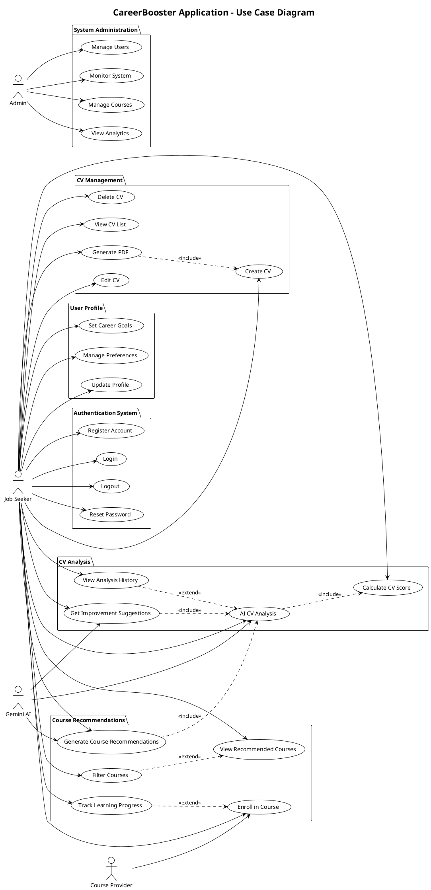
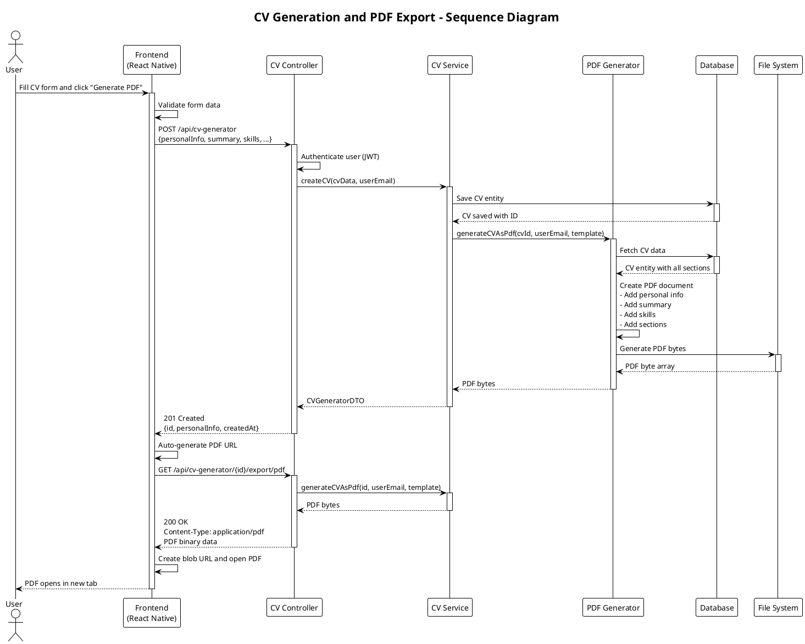
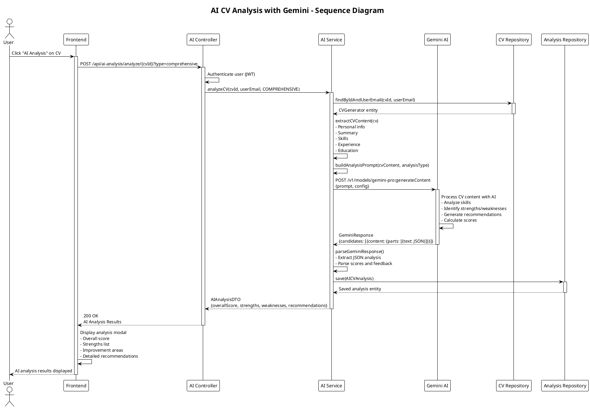
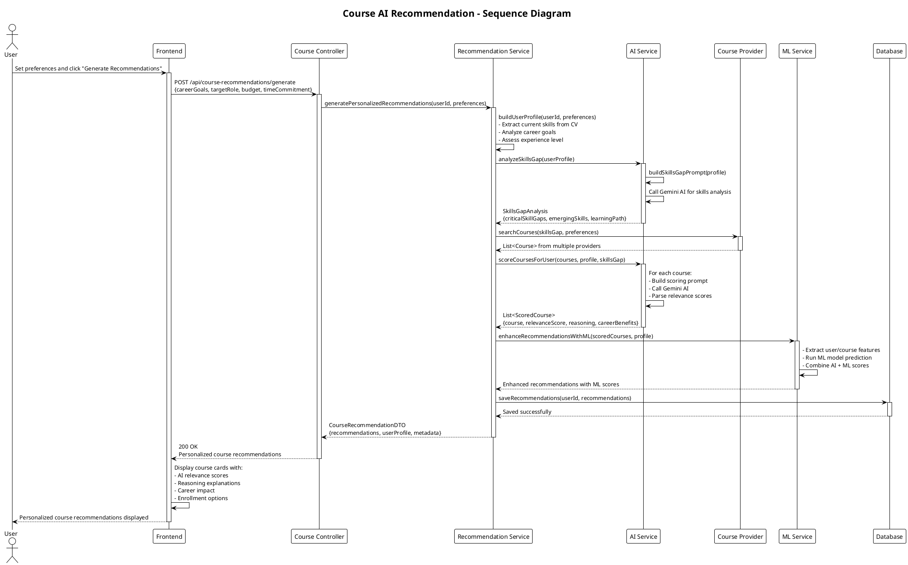
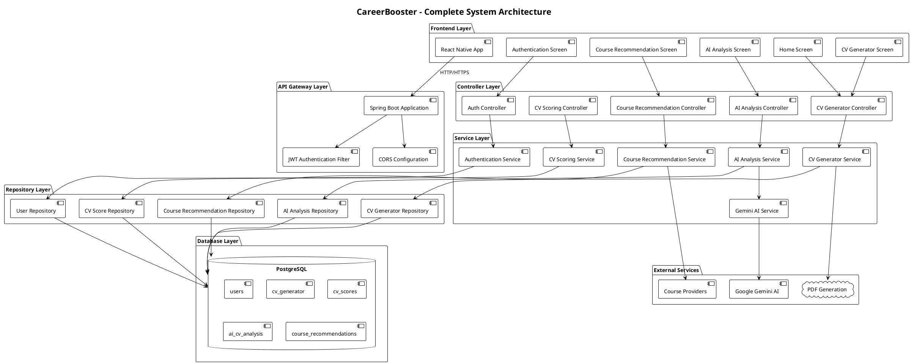

```plantuml
@startuml CareerBooster_Repository_Classes
!theme plain
title CareerBooster - Repository Layer Classes

package "JPA Repositories" {
  interface JpaRepository<T, ID> {
    +save(entity: T): T
    +findById(id: ID): Optional<T>
    +findAll(): List<T>
    +deleteById(id: ID): void
    +count(): long
  }

  interface UserRepository {
    +findByEmail(email: String): Optional<User>
    +existsByEmail(email: String): Boolean
    +findByEmailAndActiveTrue(email: String): Optional<User>
  }

  interface CVGeneratorRepository {
    +findByUserEmail(userEmail: String): List<CVGenerator>
    +findByIdAndUserEmail(id: Long, userEmail: String): Optional<CVGenerator>
    +findByUserEmailOrderByCreatedAtDesc(userEmail: String): List<CVGenerator>
    +countByUserEmail(userEmail: String): Long
  }

  interface CVScoreRepository {
    +findByCvId(cvId: Long): Optional<CVScore>
    +findByUserEmail(userEmail: String): List<CVScore>
    +findAverageScore(): Double
    +deleteByCvId(cvId: Long): void
  }

  interface AICVAnalysisRepository {
    +findByCvId(cvId: Long): List<AICVAnalysis>
    +findByCvIdAndAnalysisType(cvId: Long, analysisType: AnalysisType): Optional<AICVAnalysis>
    +findByUserEmailOrderByCreatedAtDesc(userEmail: String): List<AICVAnalysis>
    +countByAnalysisType(analysisType: AnalysisType): Long
  }

  interface CourseRecommendationRepository {
    +findByUserId(userId: Long): List<CourseRecommendation>
    +findByUserIdOrderByCreatedAtDesc(userId: Long): List<CourseRecommendation>
    +deleteByUserId(userId: Long): void
  }

  interface UserInteractionRepository {
    +findByUserId(userId: Long): List<UserInteraction>
    +findByUserIdAndActionType(userId: Long, actionType: String): List<UserInteraction>
    +countByActionType(actionType: String): Long
  }
}

' Repository Inheritance
UserRepository --|> JpaRepository
CVGeneratorRepository --|> JpaRepository
CVScoreRepository --|> JpaRepository
AICVAnalysisRepository --|> JpaRepository
CourseRecommendationRepository --|> JpaRepository
UserInteractionRepository --|> JpaRepository

@enduml
```

# 🎯 CareerBooster Application - UML Diagrams

## 📋 Overview

This document contains comprehensive UML diagrams for the CareerBooster application, including use case diagrams, sequence diagrams, and class diagrams that illustrate the complete system architecture and user interactions.

## 🎭 Use Case Diagram

## 🔄 Sequence Diagrams

### 1. CV Generation and PDF Export Sequence

### 2. AI CV Analysis Sequence

### 3. Course Recommendation Sequence

## 🏗️ Class Diagram - Core Entities

```plantuml
@startuml CareerBooster_Core_Classes
!theme plain
title CareerBooster - Core Entity Classes

package "User Management" {
  class User {
    -Long id
    -String email
    -String password
    -String firstName
    -String lastName
    -LocalDateTime createdAt
    -LocalDateTime updatedAt
    +getFullName(): String
    +isActive(): boolean
  }

  class Role {
    -Long id
    -String name
    -String description
  }

  class UserRole {
    -Long id
    -User user
    -Role role
    -LocalDateTime assignedAt
  }
}

package "CV Management" {
  class CVGenerator {
    -Long id
    -PersonalInfo personalInfo
    -String summary
    -List<String> skills
    -List<Experience> experiences
    -List<Education> education
    -List<Project> projects
    -List<Certification> certifications
    -List<Language> languages
    -List<String> hobbies
    -List<String> volunteering
    -List<String> awards
    -User user
    -LocalDateTime createdAt
    -LocalDateTime updatedAt
    +getTotalSections(): int
    +hasCompleteProfile(): boolean
  }

  class PersonalInfo {
    -String name
    -String email
    -String phone
    -String title
    +getContactInfo(): String
  }

  class Experience {
    -Long id
    -String position
    -String company
    -String description
    -LocalDate startDate
    -LocalDate endDate
    -CVGenerator cv
    +getDurationInMonths(): int
    +isCurrentPosition(): boolean
  }

  class Education {
    -Long id
    -String degree
    -String institution
    -String fieldOfStudy
    -LocalDate graduationDate
    -Double gpa
    -CVGenerator cv
    +getFormattedGPA(): String
  }

  class Project {
    -Long id
    -String name
    -String description
    -String technologies
    -String projectUrl
    -LocalDate startDate
    -LocalDate endDate
    -CVGenerator cv
    +getTechnologyList(): List<String>
  }

  class Certification {
    -Long id
    -String name
    -String issuingOrganization
    -LocalDate issueDate
    -LocalDate expirationDate
    -String credentialId
    -CVGenerator cv
    +isExpired(): boolean
  }

  class Language {
    -Long id
    -String language
    -String proficiencyLevel
    -CVGenerator cv
  }
}

package "CV Analysis" {
  class CVScore {
    -Long id
    -CVGenerator cv
    -Double totalScore
    -Double summaryScore
    -Double experienceScore
    -Double educationScore
    -Double skillsScore
    -Double projectsScore
    -String feedback
    -LocalDateTime createdAt
    -LocalDateTime updatedAt
    +getGrade(): String
    +getScoreCategory(): String
  }

  class AICVAnalysis {
    -Long id
    -CVGenerator cv
    -AnalysisType analysisType
    -Integer overallScore
    -String strengths
    -String weaknesses
    -String recommendations
    -String industryAlignment
    -String atsCompatibility
    -String careerAdvice
    -String geminiResponseId
    -Long processingTimeMs
    -LocalDateTime createdAt
    -LocalDateTime updatedAt
    +getStrengthsList(): List<String>
    +getWeaknessesList(): List<String>
  }

  enum AnalysisType {
    COMPREHENSIVE
    ATS_OPTIMIZATION
    INDUSTRY_SPECIFIC
    SKILLS_GAP
    CAREER_PROGRESSION
  }
}

package "Course Recommendations" {
  class CourseRecommendation {
    -Long id
    -User user
    -String requestData
    -String recommendationsData
    -String skillsGapAnalysis
    -String aiReasoning
    -Long processingTimeMs
    -LocalDateTime createdAt
    -LocalDateTime updatedAt
    +getRecommendationCount(): int
  }

  class Course {
    -String id
    -String title
    -String description
    -String provider
    -CourseProvider providerType
    -String level
    -Integer duration
    -Double price
    -Double rating
    -Integer enrollmentCount
    -List<String> skillsCovered
    -List<String> instructors
    -String language
    -Boolean hasCertificate
    -Boolean hasVideoContent
    -String enrollmentUrl
    -LocalDateTime createdAt
    -LocalDateTime updatedAt
    +isFree(): boolean
    +getFormattedPrice(): String
  }

  enum CourseProvider {
    COURSERA
    UDEMY
    EDX
    PLURALSIGHT
    LINKEDIN_LEARNING
    INTERNAL
  }

  class UserInteraction {
    -Long id
    -Long userId
    -String courseId
    -String actionType
    -String contentType
    -Integer duration
    -String metadata
    -Instant timestamp
    +getActionCategory(): String
  }
}

' Relationships
User ||--o{ CVGenerator : creates
User ||--o{ UserRole : has
Role ||--o{ UserRole : assigned_to
CVGenerator ||--|| PersonalInfo : contains
CVGenerator ||--o{ Experience : has
CVGenerator ||--o{ Education : has
CVGenerator ||--o{ Project : has
CVGenerator ||--o{ Certification : has
CVGenerator ||--o{ Language : has
CVGenerator ||--|| CVScore : scored_by
CVGenerator ||--o{ AICVAnalysis : analyzed_by
AICVAnalysis }o--|| AnalysisType : uses
User ||--o{ CourseRecommendation : receives
Course }o--|| CourseProvider : provided_by
User ||--o{ UserInteraction : performs

@enduml
```

## 🔧 Class Diagram - Service Layer

```plantuml
@startuml CareerBooster_Service_Classes
!theme plain
title CareerBooster - Service Layer Classes

package "Authentication Services" {
  class AuthenticationService {
    -UserRepository userRepository
    -PasswordEncoder passwordEncoder
    -JwtUtil jwtUtil
    +authenticate(email: String, password: String): AuthenticationResponse
    +register(userDTO: UserRegistrationDTO): User
    +refreshToken(token: String): String
    +logout(token: String): void
  }

  class JwtUtil {
    -String secretKey
    -Long expiration
    +generateToken(userDetails: UserDetails): String
    +extractUsername(token: String): String
    +validateToken(token: String, userDetails: UserDetails): Boolean
    +isTokenExpired(token: String): Boolean
  }
}

package "CV Services" {
  class CVGeneratorService {
    <<interface>>
    +createCV(cvDTO: CVGeneratorDTO, userEmail: String): CVGeneratorDTO
    +updateCV(id: Long, cvDTO: CVGeneratorDTO, userEmail: String): CVGeneratorDTO
    +getCVById(id: Long, userEmail: String): Optional<CVGenerator>
    +getUserCVs(userEmail: String): List<CVGeneratorDTO>
    +deleteCV(id: Long, userEmail: String): void
    +generateCVAsPdf(id: Long, userEmail: String, template: String): byte[]
  }

  class CVGeneratorServiceImpl {
    -CVGeneratorRepository cvGeneratorRepository
    -UserRepository userRepository
    -CVGeneratorMapper cvGeneratorMapper
    +createCV(cvDTO: CVGeneratorDTO, userEmail: String): CVGeneratorDTO
    +generateCVAsPdf(id: Long, userEmail: String, template: String): byte[]
    -addPersonalInfoSection(document: Document, personalInfo: PersonalInfo): void
    -addSummarySection(document: Document, summary: String): void
    -addSkillsSection(document: Document, skills: List<String>): void
  }

  class CVScoringService {
    -CVScoreRepository cvScoreRepository
    -CVGeneratorRepository cvGeneratorRepository
    +calculateCVScore(cvId: Long, userEmail: String): CVScoreDTO
    +getCVScore(cvId: Long, userEmail: String): CVScoreDTO
    -calculateSummaryScore(summary: String): double
    -calculateSkillsScore(skills: List<String>): double
    -calculateExperienceScore(experiences: List<Experience>): double
  }
}

package "AI Services" {
  class GeminiAIService {
    -String geminiApiKey
    -String geminiApiUrl
    -WebClient webClient
    -ObjectMapper objectMapper
    +analyzeCVContent(cvContent: String, analysisType: String): Mono<GeminiResponse>
    -buildGeminiRequest(cvContent: String, analysisType: String): GeminiRequest
    -buildAnalysisPrompt(cvContent: String, analysisType: String): String
  }

  class AIAnalysisServiceImpl {
    -GeminiAIService geminiAIService
    -CVGeneratorRepository cvRepository
    -AICVAnalysisRepository analysisRepository
    +analyzeCV(cvId: Long, userEmail: String, analysisType: AnalysisType): Mono<AIAnalysisDTO>
    -extractCVContent(cv: CVGenerator): String
    -processGeminiResponse(cv: CVGenerator, response: GeminiResponse): AIAnalysisDTO
  }

  class CourseRecommendationAIService {
    -GeminiAIService geminiAIService
    -CourseProviderService courseProviderService
    -UserProfileService userProfileService
    +generatePersonalizedRecommendations(userId: Long, request: RecommendationRequestDTO): Mono<CourseRecommendationDTO>
    -buildUserProfile(userId: Long, request: RecommendationRequestDTO): UserProfileAnalysis
    -analyzeSkillsGap(profile: UserProfileAnalysis): Mono<SkillsGapAnalysis>
  }
}

' Service Relationships
CVGeneratorServiceImpl ..|> CVGeneratorService : implements
CVGeneratorServiceImpl --> CVScoringService : uses
AIAnalysisServiceImpl --> GeminiAIService : uses
CourseRecommendationAIService --> GeminiAIService : uses

@enduml
```

## 🎮 Class Diagram - Controller Layer

```plantuml
@startuml CareerBooster_Controller_Classes
!theme plain
title CareerBooster - Controller Layer Classes

package "Authentication Controllers" {
  class AuthController {
    -AuthenticationService authenticationService
    -UserService userService
    +login(loginRequest: LoginRequestDTO): ResponseEntity<AuthenticationResponse>
    +register(registrationRequest: UserRegistrationDTO): ResponseEntity<UserDTO>
    +refreshToken(refreshRequest: RefreshTokenRequestDTO): ResponseEntity<TokenResponse>
    +logout(logoutRequest: LogoutRequestDTO): ResponseEntity<Void>
  }
}

package "CV Controllers" {
  class CVGeneratorController {
    -CVGeneratorService cvGeneratorService
    +createCV(cvDTO: CVGeneratorDTO, auth: Authentication): ResponseEntity<CVGeneratorDTO>
    +updateCV(id: Long, cvDTO: CVGeneratorDTO, auth: Authentication): ResponseEntity<CVGeneratorDTO>
    +getCVById(id: Long, auth: Authentication): ResponseEntity<CVGeneratorDTO>
    +getUserCVs(auth: Authentication): ResponseEntity<List<CVGeneratorDTO>>
    +deleteCV(id: Long, auth: Authentication): ResponseEntity<Void>
    +exportCVAsPdf(id: Long, template: String, auth: Authentication): ResponseEntity<byte[]>
  }

  class CVScoringController {
    -CVScoringService cvScoringService
    +calculateScore(cvId: Long, auth: Authentication): ResponseEntity<CVScoreDTO>
    +getScore(cvId: Long, auth: Authentication): ResponseEntity<CVScoreDTO>
    +getScoreHistory(cvId: Long, auth: Authentication): ResponseEntity<List<CVScoreDTO>>
  }
}

package "AI Analysis Controllers" {
  class AIAnalysisController {
    -AIAnalysisService aiAnalysisService
    +analyzeCVWithAI(cvId: Long, analysisType: String, auth: Authentication): ResponseEntity<Mono<AIAnalysisDTO>>
    +getAnalysisHistory(cvId: Long, auth: Authentication): ResponseEntity<List<AIAnalysisDTO>>
    +compareWithIndustryStandards(request: ComparisonRequestDTO, auth: Authentication): ResponseEntity<Mono<ComparisonAnalysisDTO>>
  }
}

package "Course Recommendation Controllers" {
  class CourseRecommendationController {
    -CourseRecommendationAIService recommendationService
    -UserBehaviorTracker behaviorTracker
    +generateRecommendations(request: RecommendationRequestDTO, auth: Authentication): ResponseEntity<Mono<CourseRecommendationResponseDTO>>
    +enrollInCourse(courseId: String, auth: Authentication): ResponseEntity<EnrollmentResponseDTO>
    +trackUserInteraction(eventDTO: UserInteractionEventDTO, auth: Authentication): ResponseEntity<Void>
    +getRecommendationHistory(auth: Authentication): ResponseEntity<List<CourseRecommendationHistoryDTO>>
  }
}

' Controller Dependencies
CVGeneratorController --> CVGeneratorService : uses
CVScoringController --> CVScoringService : uses
AIAnalysisController --> AIAnalysisService : uses
CourseRecommendationController --> CourseRecommendationAIService : uses
AuthController --> AuthenticationService : uses

@enduml
```

## 📊 Class Diagram - Repository Layer

## 📋 Complete System Architecture Overview

## 🎯 Summary

This comprehensive UML documentation provides:

### ✅ **Use Case Diagram**

- **25 use cases** covering all major features
- **4 actors**: Job Seeker, Admin, Gemini AI, Course Provider
- **Include/Extend relationships** showing feature dependencies

### ✅ **Sequence Diagrams**

- **CV Generation Flow**: Complete PDF generation process
- **AI Analysis Flow**: Gemini AI integration for CV analysis
- **Course Recommendation Flow**: AI-powered course suggestions

### ✅ **Class Diagrams**

- **Core Entities**: 15+ domain models with relationships
- **Service Layer**: Business logic and AI integration services
- **Controller Layer**: REST API endpoints and request handling
- **Repository Layer**: Data access patterns and JPA repositories
- **System Architecture**: Complete system overview

### ✅ **Key Features Documented**

- **Authentication & Authorization**: JWT-based security
- **CV Management**: Creation, editing, PDF generation
- **AI Analysis**: Gemini AI integration for CV insights
- **Course Recommendations**: Personalized learning suggestions
- **Scoring System**: CV evaluation and feedback

This documentation provides a complete technical blueprint for understanding and extending the CareerBooster application! 🚀
