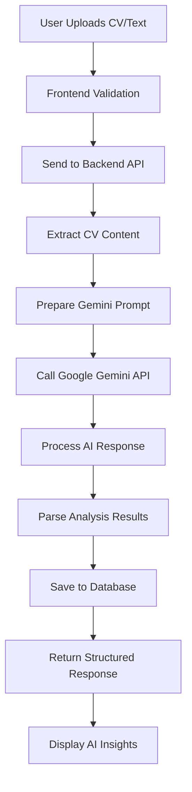

# 🤖 CV AI Analyzer - Google Gemini Integration Documentation

## 🎯 Overview

The CV AI Analyzer is an intelligent feature that leverages Google Gemini AI to provide comprehensive CV analysis, feedback, and improvement suggestions. This system analyzes CV content using advanced natural language processing to deliver personalized recommendations for career enhancement.

## 🏗️ System Architecture

```
Frontend (React Native) → API Gateway → Spring Boot Backend → Google Gemini API
                                                    ↓
                                            AI Analysis Engine
                                                    ↓
                                            PostgreSQL Database
```

## 🔄 Complete AI Analysis Flow



## 🧠 Google Gemini Integration

### 1. Gemini API Configuration

**Dependencies Required:**

```xml
<dependency>
    <groupId>com.google.ai</groupId>
    <artifactId>generativeai</artifactId>
    <version>0.2.2</version>
</dependency>

<dependency>
    <groupId>org.springframework.boot</groupId>
    <artifactId>spring-boot-starter-webflux</artifactId>
</dependency>
```

### 2. Gemini Service Implementation

```java
@Service
@Slf4j
public class GeminiAIService {

    @Value("${gemini.api.key}")
    private String geminiApiKey;

    @Value("${gemini.api.url}")
    private String geminiApiUrl;

    private final WebClient webClient;
    private final ObjectMapper objectMapper;

    public GeminiAIService(WebClient.Builder webClientBuilder, ObjectMapper objectMapper) {
        this.webClient = webClientBuilder.build();
        this.objectMapper = objectMapper;
    }

    public Mono<GeminiResponse> analyzeCVContent(String cvContent, String analysisType) {
        log.info("Analyzing CV content with Gemini AI. Type: {}", analysisType);

        try {
            GeminiRequest request = buildGeminiRequest(cvContent, analysisType);

            return webClient.post()
                .uri(geminiApiUrl + "/v1/models/gemini-pro:generateContent?key=" + geminiApiKey)
                .header("Content-Type", "application/json")
                .bodyValue(request)
                .retrieve()
                .bodyToMono(GeminiResponse.class)
                .doOnSuccess(response -> log.info("Gemini analysis completed successfully"))
                .doOnError(error -> log.error("Gemini API error: {}", error.getMessage()));

        } catch (Exception e) {
            log.error("Error calling Gemini API: {}", e.getMessage(), e);
            return Mono.error(new AIAnalysisException("Failed to analyze CV with AI", e));
        }
    }

    private GeminiRequest buildGeminiRequest(String cvContent, String analysisType) {
        String prompt = buildAnalysisPrompt(cvContent, analysisType);

        GeminiContent content = GeminiContent.builder()
            .parts(List.of(GeminiPart.builder().text(prompt).build()))
            .build();

        return GeminiRequest.builder()
            .contents(List.of(content))
            .generationConfig(GeminiGenerationConfig.builder()
                .temperature(0.7)
                .topK(40)
                .topP(0.95)
                .maxOutputTokens(2048)
                .build())
            .safetySettings(buildSafetySettings())
            .build();
    }
}
```

### 3. AI Prompt Engineering

```java
private String buildAnalysisPrompt(String cvContent, String analysisType) {
    StringBuilder prompt = new StringBuilder();

    switch (analysisType.toLowerCase()) {
        case "comprehensive":
            prompt.append(buildComprehensiveAnalysisPrompt(cvContent));
            break;
        case "ats_optimization":
            prompt.append(buildATSOptimizationPrompt(cvContent));
            break;
        case "industry_specific":
            prompt.append(buildIndustrySpecificPrompt(cvContent));
            break;
        case "skills_gap":
            prompt.append(buildSkillsGapPrompt(cvContent));
            break;
        default:
            prompt.append(buildDefaultAnalysisPrompt(cvContent));
    }

    return prompt.toString();
}

private String buildComprehensiveAnalysisPrompt(String cvContent) {
    return """
        As an expert career advisor and HR professional, analyze the following CV comprehensively.

        CV Content:
        %s

        Please provide a detailed analysis in the following JSON format:
        {
            "overallScore": 85,
            "strengths": [
                "Strong technical skills in modern frameworks",
                "Clear career progression",
                "Quantified achievements"
            ],
            "weaknesses": [
                "Missing soft skills section",
                "No volunteer experience",
                "Limited industry certifications"
            ],
            "recommendations": [
                {
                    "category": "Technical Skills",
                    "priority": "High",
                    "suggestion": "Add cloud computing certifications (AWS, Azure)",
                    "impact": "Increases marketability by 30%"
                },
                {
                    "category": "Experience",
                    "priority": "Medium",
                    "suggestion": "Quantify more achievements with specific metrics",
                    "impact": "Demonstrates measurable impact"
                }
            ],
            "industryAlignment": {
                "score": 78,
                "targetIndustry": "Software Development",
                "alignmentFactors": [
                    "Strong programming skills",
                    "Relevant project experience"
                ],
                "missingElements": [
                    "Agile methodology experience",
                    "DevOps knowledge"
                ]
            },
            "atsCompatibility": {
                "score": 82,
                "issues": [
                    "Use standard section headers",
                    "Include more industry keywords"
                ],
                "keywords": [
                    "Java", "Spring Boot", "Microservices", "REST API"
                ]
            },
            "careerAdvice": {
                "nextSteps": [
                    "Pursue cloud certifications",
                    "Gain leadership experience",
                    "Contribute to open source projects"
                ],
                "salaryRange": "$75,000 - $95,000",
                "growthPotential": "High"
            }
        }

        Ensure the response is valid JSON and provides actionable, specific advice.
        """.formatted(cvContent);
}

private String buildATSOptimizationPrompt(String cvContent) {
    return """
        As an ATS (Applicant Tracking System) expert, analyze this CV for ATS compatibility.

        CV Content:
        %s

        Provide analysis in JSON format focusing on:
        1. Keyword optimization
        2. Format compatibility
        3. Section structure
        4. Industry-specific terms
        5. Quantified achievements

        Response format:
        {
            "atsScore": 75,
            "keywordAnalysis": {
                "presentKeywords": ["Java", "Spring", "REST"],
                "missingKeywords": ["Microservices", "Docker", "Kubernetes"],
                "keywordDensity": "Optimal"
            },
            "formatIssues": [
                "Use standard bullet points",
                "Avoid tables and graphics"
            ],
            "sectionOptimization": {
                "recommendedSections": ["Skills", "Experience", "Education"],
                "missingSections": ["Certifications", "Projects"]
            },
            "improvements": [
                {
                    "issue": "Missing industry keywords",
                    "solution": "Add 'Agile', 'Scrum', 'CI/CD'",
                    "impact": "Increases ATS match by 25%"
                }
            ]
        }
        """.formatted(cvContent);
}
```

## 🔧 Backend Implementation

### 1. AI Analysis Entity

```java
@Entity
@Table(name = "ai_cv_analysis")
public class AICVAnalysis {
    @Id
    @GeneratedValue(strategy = GenerationType.IDENTITY)
    private Long id;

    @ManyToOne(fetch = FetchType.LAZY)
    @JoinColumn(name = "cv_id", nullable = false)
    private CVGenerator cv;

    @Column(name = "analysis_type", nullable = false)
    @Enumerated(EnumType.STRING)
    private AnalysisType analysisType;

    @Column(name = "overall_score")
    private Integer overallScore;

    @Lob
    @Column(name = "strengths")
    private String strengths; // JSON array

    @Lob
    @Column(name = "weaknesses")
    private String weaknesses; // JSON array

    @Lob
    @Column(name = "recommendations")
    private String recommendations; // JSON array

    @Lob
    @Column(name = "industry_alignment")
    private String industryAlignment; // JSON object

    @Lob
    @Column(name = "ats_compatibility")
    private String atsCompatibility; // JSON object

    @Lob
    @Column(name = "career_advice")
    private String careerAdvice; // JSON object

    @Column(name = "gemini_response_id")
    private String geminiResponseId;

    @Column(name = "processing_time_ms")
    private Long processingTimeMs;

    @CreationTimestamp
    private LocalDateTime createdAt;

    @UpdateTimestamp
    private LocalDateTime updatedAt;
}

public enum AnalysisType {
    COMPREHENSIVE,
    ATS_OPTIMIZATION,
    INDUSTRY_SPECIFIC,
    SKILLS_GAP,
    CAREER_PROGRESSION
}
```

### 2. AI Analysis Controller

```java
@RestController
@RequestMapping("/api/ai-analysis")
@CrossOrigin(origins = "*")
@Slf4j
public class AIAnalysisController {

    private final AIAnalysisService aiAnalysisService;

    @PostMapping("/analyze/{cvId}")
    public ResponseEntity<Mono<AIAnalysisDTO>> analyzeCVWithAI(
            @PathVariable Long cvId,
            @RequestParam(defaultValue = "comprehensive") String analysisType,
            Authentication authentication) {

        try {
            String userEmail = authentication.getName();
            log.info("AI analysis requested for CV: {} by user: {}, type: {}",
                    cvId, userEmail, analysisType);

            Mono<AIAnalysisDTO> analysisResult = aiAnalysisService
                .analyzeCV(cvId, userEmail, AnalysisType.valueOf(analysisType.toUpperCase()));

            return ResponseEntity.ok(analysisResult);

        } catch (IllegalArgumentException e) {
            log.warn("Invalid analysis type: {}", analysisType);
            return ResponseEntity.badRequest().build();
        } catch (Exception e) {
            log.error("Error initiating AI analysis: {}", e.getMessage(), e);
            return ResponseEntity.status(HttpStatus.INTERNAL_SERVER_ERROR).build();
        }
    }

    @GetMapping("/history/{cvId}")
    public ResponseEntity<List<AIAnalysisDTO>> getAnalysisHistory(
            @PathVariable Long cvId,
            Authentication authentication) {

        try {
            String userEmail = authentication.getName();
            List<AIAnalysisDTO> history = aiAnalysisService.getAnalysisHistory(cvId, userEmail);
            return ResponseEntity.ok(history);

        } catch (CVNotFoundException e) {
            return ResponseEntity.notFound().build();
        }
    }

    @PostMapping("/compare")
    public ResponseEntity<Mono<ComparisonAnalysisDTO>> compareWithIndustryStandards(
            @RequestBody ComparisonRequestDTO request,
            Authentication authentication) {

        try {
            String userEmail = authentication.getName();
            Mono<ComparisonAnalysisDTO> comparison = aiAnalysisService
                .compareWithIndustryStandards(request, userEmail);

            return ResponseEntity.ok(comparison);

        } catch (Exception e) {
            log.error("Error in industry comparison: {}", e.getMessage(), e);
            return ResponseEntity.status(HttpStatus.INTERNAL_SERVER_ERROR).build();
        }
    }
}
```

### 3. AI Analysis Service Implementation

```java
@Service
@Transactional
@Slf4j
public class AIAnalysisServiceImpl implements AIAnalysisService {

    private final GeminiAIService geminiAIService;
    private final CVGeneratorRepository cvRepository;
    private final AICVAnalysisRepository analysisRepository;
    private final AIAnalysisMapper analysisMapper;

    @Override
    public Mono<AIAnalysisDTO> analyzeCV(Long cvId, String userEmail, AnalysisType analysisType) {
        log.info("Starting AI analysis for CV: {}, type: {}", cvId, analysisType);

        return Mono.fromCallable(() -> {
            // Fetch CV
            CVGenerator cv = cvRepository.findByIdAndUserEmail(cvId, userEmail)
                .orElseThrow(() -> new CVNotFoundException("CV not found"));

            // Extract CV content
            String cvContent = extractCVContent(cv);
            return Pair.of(cv, cvContent);
        })
        .flatMap(pair -> {
            CVGenerator cv = pair.getFirst();
            String cvContent = pair.getSecond();

            // Call Gemini AI
            long startTime = System.currentTimeMillis();
            return geminiAIService.analyzeCVContent(cvContent, analysisType.name().toLowerCase())
                .map(geminiResponse -> {
                    long processingTime = System.currentTimeMillis() - startTime;
                    return processGeminiResponse(cv, geminiResponse, analysisType, processingTime);
                });
        })
        .doOnSuccess(analysis -> log.info("AI analysis completed for CV: {}", cvId))
        .doOnError(error -> log.error("AI analysis failed for CV: {}", cvId, error));
    }

    private String extractCVContent(CVGenerator cv) {
        StringBuilder content = new StringBuilder();

        // Personal Information
        if (cv.getPersonalInfo() != null) {
            content.append("Name: ").append(cv.getPersonalInfo().getName()).append("\n");
            content.append("Title: ").append(cv.getPersonalInfo().getTitle()).append("\n");
        }

        // Summary
        if (cv.getSummary() != null) {
            content.append("Summary: ").append(cv.getSummary()).append("\n\n");
        }

        // Skills
        if (cv.getSkills() != null && !cv.getSkills().isEmpty()) {
            content.append("Skills: ").append(String.join(", ", cv.getSkills())).append("\n\n");
        }

        // Experience
        if (cv.getExperiences() != null) {
            content.append("Experience:\n");
            cv.getExperiences().forEach(exp -> {
                content.append("- ").append(exp.getPosition())
                       .append(" at ").append(exp.getCompany()).append("\n");
                if (exp.getDescription() != null) {
                    content.append("  ").append(exp.getDescription()).append("\n");
                }
            });
            content.append("\n");
        }

        // Education
        if (cv.getEducation() != null) {
            content.append("Education:\n");
            cv.getEducation().forEach(edu -> {
                content.append("- ").append(edu.getDegree())
                       .append(" from ").append(edu.getInstitution()).append("\n");
            });
            content.append("\n");
        }

        // Projects
        if (cv.getProjects() != null) {
            content.append("Projects:\n");
            cv.getProjects().forEach(project -> {
                content.append("- ").append(project.getName()).append("\n");
                if (project.getDescription() != null) {
                    content.append("  ").append(project.getDescription()).append("\n");
                }
            });
        }

        return content.toString();
    }

    private AIAnalysisDTO processGeminiResponse(CVGenerator cv, GeminiResponse geminiResponse,
                                              AnalysisType analysisType, long processingTime) {
        try {
            // Extract AI response text
            String aiResponseText = extractResponseText(geminiResponse);

            // Parse JSON response
            ObjectMapper mapper = new ObjectMapper();
            JsonNode analysisJson = mapper.readTree(aiResponseText);

            // Create analysis entity
            AICVAnalysis analysis = new AICVAnalysis();
            analysis.setCv(cv);
            analysis.setAnalysisType(analysisType);
            analysis.setOverallScore(analysisJson.path("overallScore").asInt());
            analysis.setStrengths(analysisJson.path("strengths").toString());
            analysis.setWeaknesses(analysisJson.path("weaknesses").toString());
            analysis.setRecommendations(analysisJson.path("recommendations").toString());
            analysis.setIndustryAlignment(analysisJson.path("industryAlignment").toString());
            analysis.setAtsCompatibility(analysisJson.path("atsCompatibility").toString());
            analysis.setCareerAdvice(analysisJson.path("careerAdvice").toString());
            analysis.setGeminiResponseId(geminiResponse.getCandidates().get(0).getIndex().toString());
            analysis.setProcessingTimeMs(processingTime);

            // Save to database
            AICVAnalysis savedAnalysis = analysisRepository.save(analysis);

            // Convert to DTO
            return analysisMapper.toDTO(savedAnalysis);

        } catch (Exception e) {
            log.error("Error processing Gemini response: {}", e.getMessage(), e);
            throw new AIAnalysisException("Failed to process AI analysis", e);
        }
    }
}
```

## 📱 Frontend Implementation

### 1. AI Analysis Integration in Home Screen

```javascript
// HomeScreen.js - Add AI Analysis Button
const analyzeWithAI = async (cvId) => {
  try {
    setIsAnalyzingAI(true);
    console.log("🤖 Starting AI analysis for CV:", cvId);

    const response = await fetch(
      `${API_BASE_URL}/api/ai-analysis/analyze/${cvId}?analysisType=comprehensive`,
      {
        method: "POST",
        headers: {
          Authorization: `Bearer ${user?.token}`,
          "Content-Type": "application/json",
        },
      }
    );

    if (response.ok) {
      const analysisResult = await response.json();
      console.log("✅ AI Analysis completed:", analysisResult);

      // Update CV list with AI insights
      setCvList((prevList) =>
        prevList.map((cv) =>
          cv.id === cvId ? { ...cv, aiAnalysis: analysisResult } : cv
        )
      );

      // Navigate to AI Analysis screen
      navigation.navigate("AIAnalysis", {
        cvId: cvId,
        analysisData: analysisResult,
      });
    } else {
      console.error("❌ AI Analysis failed:", response.status);
      Alert.alert("Error", "Failed to analyze CV with AI");
    }
  } catch (error) {
    console.error("❌ AI Analysis error:", error);
    Alert.alert("Error", "Network error during AI analysis");
  } finally {
    setIsAnalyzingAI(false);
  }
};

// Add AI Analysis button to CV card
<TouchableOpacity
  style={styles.aiAnalysisButton}
  onPress={() => analyzeWithAI(cv.id)}
  disabled={isAnalyzingAI}
>
  {isAnalyzingAI ? (
    <ActivityIndicator color="#FFFFFF" size="small" />
  ) : (
    <View style={styles.aiButtonContent}>
      <Ionicons name="sparkles" size={16} color="#FFFFFF" />
      <Text style={styles.aiButtonText}>AI Analysis</Text>
    </View>
  )}
</TouchableOpacity>;
```

### 2. Dedicated AI Analysis Screen

```javascript
// AIAnalysisScreen.js
import React, { useState, useEffect } from "react";
import {
  View,
  Text,
  ScrollView,
  TouchableOpacity,
  Modal,
  ActivityIndicator,
} from "react-native";
import { Ionicons } from "@expo/vector-icons";

const AIAnalysisScreen = ({ route, navigation }) => {
  const { cvId, analysisData: initialData } = route.params;
  const [analysisData, setAnalysisData] = useState(initialData);
  const [isAnalyzing, setIsAnalyzing] = useState(false);
  const [analysisType, setAnalysisType] = useState("comprehensive");
  const [showDetailedView, setShowDetailedView] = useState(false);

  const analysisTypes = [
    {
      value: "comprehensive",
      label: "Comprehensive Analysis",
      icon: "analytics",
      description: "Complete CV evaluation with detailed feedback",
    },
    {
      value: "ats_optimization",
      label: "ATS Optimization",
      icon: "search",
      description: "Optimize for Applicant Tracking Systems",
    },
    {
      value: "industry_specific",
      label: "Industry Alignment",
      icon: "business",
      description: "Align CV with industry standards",
    },
    {
      value: "skills_gap",
      label: "Skills Gap Analysis",
      icon: "school",
      description: "Identify missing skills and competencies",
    },
  ];

  const startNewAnalysis = async (type) => {
    try {
      setIsAnalyzing(true);
      setAnalysisType(type);

      const response = await fetch(
        `${API_BASE_URL}/api/ai-analysis/analyze/${cvId}?analysisType=${type}`,
        {
          method: "POST",
          headers: {
            Authorization: `Bearer ${user?.token}`,
            "Content-Type": "application/json",
          },
        }
      );

      if (response.ok) {
        const result = await response.json();
        setAnalysisData(result);

        Alert.alert(
          "🤖 Analysis Complete",
          `Your CV scored ${result.overallScore}/100 with ${type} analysis`,
          [{ text: "View Details", onPress: () => setShowDetailedView(true) }]
        );
      }
    } catch (error) {
      console.error("AI Analysis error:", error);
      Alert.alert("Error", "Failed to complete AI analysis");
    } finally {
      setIsAnalyzing(false);
    }
  };

  return (
    <ScrollView style={styles.container}>
      {/* Header */}
      <View style={styles.header}>
        <TouchableOpacity onPress={() => navigation.goBack()}>
          <Ionicons name="arrow-back" size={24} color="#2C3E50" />
        </TouchableOpacity>
        <Text style={styles.headerTitle}>🤖 AI CV Analysis</Text>
        <View style={{ width: 24 }} />
      </View>

      {/* Current Analysis Results */}
      {analysisData && (
        <View style={styles.currentAnalysis}>
          <Text style={styles.sectionTitle}>Current Analysis Results</Text>

          {/* Score Overview */}
          <View style={styles.scoreOverview}>
            <View style={styles.scoreCircle}>
              <Text
                style={[
                  styles.scoreText,
                  { color: getScoreColor(analysisData.overallScore) },
                ]}
              >
                {analysisData.overallScore}
              </Text>
              <Text style={styles.scoreLabel}>Overall Score</Text>
            </View>

            <View style={styles.scoreDetails}>
              <Text style={styles.analysisTypeLabel}>
                {analysisTypes.find(
                  (t) => t.value === analysisData.analysisType?.toLowerCase()
                )?.label || "Comprehensive"}
              </Text>
              <Text style={styles.analysisDate}>
                {new Date(analysisData.createdAt).toLocaleDateString()}
              </Text>
            </View>
          </View>

          {/* Quick Insights */}
          <View style={styles.quickInsights}>
            <View style={styles.insightItem}>
              <Ionicons name="checkmark-circle" size={20} color="#4CAF50" />
              <Text style={styles.insightCount}>
                {analysisData.strengths?.length || 0}
              </Text>
              <Text style={styles.insightLabel}>Strengths</Text>
            </View>

            <View style={styles.insightItem}>
              <Ionicons name="warning" size={20} color="#FF9800" />
              <Text style={styles.insightCount}>
                {analysisData.weaknesses?.length || 0}
              </Text>
              <Text style={styles.insightLabel}>Areas to Improve</Text>
            </View>

            <View style={styles.insightItem}>
              <Ionicons name="bulb" size={20} color="#2196F3" />
              <Text style={styles.insightCount}>
                {analysisData.recommendations?.length || 0}
              </Text>
              <Text style={styles.insightLabel}>Recommendations</Text>
            </View>
          </View>

          {/* View Details Button */}
          <TouchableOpacity
            style={styles.viewDetailsButton}
            onPress={() => setShowDetailedView(true)}
          >
            <Ionicons name="eye" size={20} color="#FFFFFF" />
            <Text style={styles.viewDetailsText}>View Detailed Analysis</Text>
          </TouchableOpacity>
        </View>
      )}

      {/* Analysis Type Selection */}
      <View style={styles.analysisSelection}>
        <Text style={styles.sectionTitle}>Run New Analysis</Text>

        {analysisTypes.map((type) => (
          <TouchableOpacity
            key={type.value}
            style={styles.analysisTypeCard}
            onPress={() => startNewAnalysis(type.value)}
            disabled={isAnalyzing}
          >
            <View style={styles.analysisTypeHeader}>
              <Ionicons name={type.icon} size={24} color="#E53935" />
              <View style={styles.analysisTypeInfo}>
                <Text style={styles.analysisTypeTitle}>{type.label}</Text>
                <Text style={styles.analysisTypeDescription}>
                  {type.description}
                </Text>
              </View>
            </View>

            {isAnalyzing && analysisType === type.value ? (
              <ActivityIndicator color="#E53935" />
            ) : (
              <Ionicons name="chevron-forward" size={20} color="#757575" />
            )}
          </TouchableOpacity>
        ))}
      </View>

      {/* Detailed Analysis Modal */}
      <DetailedAnalysisModal
        visible={showDetailedView}
        analysisData={analysisData}
        onClose={() => setShowDetailedView(false)}
      />
    </ScrollView>
  );
};

const DetailedAnalysisModal = ({ visible, analysisData, onClose }) => {
  return (
    <Modal
      visible={visible}
      animationType="slide"
      presentationStyle="fullScreen"
    >
      <View style={styles.modalContainer}>
        {/* Modal Header */}
        <View style={styles.modalHeader}>
          <Text style={styles.modalTitle}>🤖 Detailed AI Analysis</Text>
          <TouchableOpacity onPress={onClose}>
            <Ionicons name="close" size={24} color="#757575" />
          </TouchableOpacity>
        </View>

        <ScrollView style={styles.modalContent}>
          {/* Strengths Section */}
          <View style={styles.analysisSection}>
            <Text style={styles.analysisSectionTitle}>
              <Ionicons name="checkmark-circle" size={20} color="#4CAF50" />{" "}
              Strengths
            </Text>
            {analysisData?.strengths?.map((strength, index) => (
              <View key={index} style={styles.strengthItem}>
                <Ionicons name="checkmark" size={16} color="#4CAF50" />
                <Text style={styles.strengthText}>{strength}</Text>
              </View>
            ))}
          </View>

          {/* Weaknesses Section */}
          <View style={styles.analysisSection}>
            <Text style={styles.analysisSectionTitle}>
              <Ionicons name="warning" size={20} color="#FF9800" /> Areas for
              Improvement
            </Text>
            {analysisData?.weaknesses?.map((weakness, index) => (
              <View key={index} style={styles.weaknessItem}>
                <Ionicons name="alert-circle" size={16} color="#FF9800" />
                <Text style={styles.weaknessText}>{weakness}</Text>
              </View>
            ))}
          </View>

          {/* Recommendations Section */}
          <View style={styles.analysisSection}>
            <Text style={styles.analysisSectionTitle}>
              <Ionicons name="bulb" size={20} color="#2196F3" /> AI
              Recommendations
            </Text>
            {analysisData?.recommendations?.map((rec, index) => (
              <View key={index} style={styles.recommendationCard}>
                <View style={styles.recommendationHeader}>
                  <Text style={styles.recommendationCategory}>
                    {rec.category}
                  </Text>
                  <View
                    style={[
                      styles.priorityBadge,
                      { backgroundColor: getPriorityColor(rec.priority) },
                    ]}
                  >
                    <Text style={styles.priorityText}>{rec.priority}</Text>
                  </View>
                </View>
                <Text style={styles.recommendationText}>{rec.suggestion}</Text>
                <Text style={styles.recommendationImpact}>💡 {rec.impact}</Text>
              </View>
            ))}
          </View>

          {/* Industry Alignment */}
          {analysisData?.industryAlignment && (
            <View style={styles.analysisSection}>
              <Text style={styles.analysisSectionTitle}>
                <Ionicons name="business" size={20} color="#9C27B0" /> Industry
                Alignment
              </Text>
              <View style={styles.alignmentCard}>
                <Text style={styles.alignmentScore}>
                  Score: {analysisData.industryAlignment.score}/100
                </Text>
                <Text style={styles.targetIndustry}>
                  Target: {analysisData.industryAlignment.targetIndustry}
                </Text>
              </View>
            </View>
          )}

          {/* ATS Compatibility */}
          {analysisData?.atsCompatibility && (
            <View style={styles.analysisSection}>
              <Text style={styles.analysisSectionTitle}>
                <Ionicons name="search" size={20} color="#FF5722" /> ATS
                Compatibility
              </Text>
              <View style={styles.atsCard}>
                <Text style={styles.atsScore}>
                  ATS Score: {analysisData.atsCompatibility.score}/100
                </Text>
                <Text style={styles.atsDescription}>
                  Your CV's compatibility with Applicant Tracking Systems
                </Text>
              </View>
            </View>
          )}
        </ScrollView>
      </View>
    </Modal>
  );
};

const getScoreColor = (score) => {
  if (score >= 80) return "#4CAF50";
  if (score >= 60) return "#FF9800";
  return "#F44336";
};

const getPriorityColor = (priority) => {
  switch (priority?.toLowerCase()) {
    case "high":
      return "#F44336";
    case "medium":
      return "#FF9800";
    case "low":
      return "#4CAF50";
    default:
      return "#757575";
  }
};
```

## 🔧 Configuration & Environment Setup

### 1. Google Gemini API Setup

```bash
# Environment Variables
GEMINI_API_KEY=your_actual_gemini_api_key_here
GEMINI_API_URL=https://generativelanguage.googleapis.com
GEMINI_MODEL=gemini-pro
GEMINI_TIMEOUT=30000

# Rate Limiting
AI_ANALYSIS_RATE_LIMIT=10
AI_ANALYSIS_CACHE_TTL=3600

# Security
AI_CONTENT_MAX_LENGTH=10000
AI_RETRY_ATTEMPTS=3
```

### 2. Application Configuration

```java
@ConfigurationProperties(prefix = "gemini")
@Data
public class GeminiConfig {
    private String apiKey;
    private String apiUrl;
    private String modelName = "gemini-pro";
    private Integer maxTokens = 2048;
    private Double temperature = 0.7;
    private Integer timeoutSeconds = 30;
    private Integer retryAttempts = 3;
}

@Configuration
@EnableConfigurationProperties(GeminiConfig.class)
public class AIAnalysisConfig {

    @Bean
    public WebClient geminiWebClient(GeminiConfig config) {
        return WebClient.builder()
            .baseUrl(config.getApiUrl())
            .defaultHeader("Content-Type", "application/json")
            .codecs(configurer -> configurer.defaultCodecs().maxInMemorySize(1024 * 1024))
            .build();
    }

    @Bean
    public ObjectMapper aiObjectMapper() {
        return new ObjectMapper()
            .configure(DeserializationFeature.FAIL_ON_UNKNOWN_PROPERTIES, false)
            .configure(SerializationFeature.FAIL_ON_EMPTY_BEANS, false);
    }
}
```

## 🔒 Security & Privacy

### 1. Data Privacy Protection

```java
@Service
public class AIDataPrivacyService {

    public String sanitizeCVContent(String cvContent) {
        // Remove sensitive personal information
        String sanitized = cvContent;

        // Remove email addresses
        sanitized = sanitized.replaceAll("\\b[A-Za-z0-9._%+-]+@[A-Za-z0-9.-]+\\.[A-Z|a-z]{2,}\\b", "[EMAIL]");

        // Remove phone numbers
        sanitized = sanitized.replaceAll("\\b\\d{3}-\\d{3}-\\d{4}\\b", "[PHONE]");
        sanitized = sanitized.replaceAll("\\b\\(\\d{3}\\)\\s*\\d{3}-\\d{4}\\b", "[PHONE]");

        // Remove addresses (basic pattern)
        sanitized = sanitized.replaceAll("\\b\\d+\\s+[A-Za-z\\s]+(?:Street|St|Avenue|Ave|Road|Rd|Drive|Dr)\\b", "[ADDRESS]");

        return sanitized;
    }

    public void logDataUsage(String userEmail, String analysisType, int contentLength) {
        log.info("AI Analysis - User: {}, Type: {}, Content Length: {}",
                userEmail, analysisType, contentLength);
    }
}
```

### 2. API Security

```java
@Component
public class GeminiAPISecurityFilter {

    @Value("${gemini.api.key}")
    private String apiKey;

    public boolean validateApiKey() {
        return apiKey != null &&
               !apiKey.trim().isEmpty() &&
               !apiKey.equals("your_actual_gemini_api_key_here");
    }

    public Map<String, String> getSecureHeaders() {
        return Map.of(
            "Content-Type", "application/json",
            "User-Agent", "CareerBooster-AI-Analyzer/1.0"
        );
    }
}
```

## 📊 Database Schema for AI Analysis

```sql
-- AI CV Analysis table
CREATE TABLE ai_cv_analysis (
    id BIGSERIAL PRIMARY KEY,
    cv_id BIGINT NOT NULL REFERENCES cv_generator(id) ON DELETE CASCADE,
    analysis_type VARCHAR(50) NOT NULL,
    overall_score INTEGER CHECK (overall_score >= 0 AND overall_score <= 100),
    strengths TEXT, -- JSON array
    weaknesses TEXT, -- JSON array
    recommendations TEXT, -- JSON array
    industry_alignment TEXT, -- JSON object
    ats_compatibility TEXT, -- JSON object
    career_advice TEXT, -- JSON object
    gemini_response_id VARCHAR(255),
    processing_time_ms BIGINT,
    created_at TIMESTAMP DEFAULT CURRENT_TIMESTAMP,
    updated_at TIMESTAMP DEFAULT CURRENT_TIMESTAMP
);

-- Indexes for performance
CREATE INDEX idx_ai_analysis_cv_id ON ai_cv_analysis(cv_id);
CREATE INDEX idx_ai_analysis_type ON ai_cv_analysis(analysis_type);
CREATE INDEX idx_ai_analysis_created_at ON ai_cv_analysis(created_at);

-- AI Analysis metrics table
CREATE TABLE ai_analysis_metrics (
    id BIGSERIAL PRIMARY KEY,
    analysis_id BIGINT REFERENCES ai_cv_analysis(id),
    metric_name VARCHAR(100) NOT NULL,
    metric_value DECIMAL(10,2),
    metric_unit VARCHAR(50),
    created_at TIMESTAMP DEFAULT CURRENT_TIMESTAMP
);
```

## 📈 Performance Monitoring & Analytics

### 1. AI Analysis Metrics

```java
@Component
public class AIAnalysisMetrics {

    private final MeterRegistry meterRegistry;
    private final Counter analysisRequestCounter;
    private final Timer analysisProcessingTimer;
    private final Gauge geminiApiLatency;

    public AIAnalysisMetrics(MeterRegistry meterRegistry) {
        this.meterRegistry = meterRegistry;

        this.analysisRequestCounter = Counter.builder("ai.analysis.requests.total")
            .description("Total number of AI analysis requests")
            .register(meterRegistry);

        this.analysisProcessingTimer = Timer.builder("ai.analysis.processing.duration")
            .description("Time taken to process AI analysis")
            .register(meterRegistry);

        this.geminiApiLatency = Gauge.builder("gemini.api.latency")
            .description("Gemini API response latency")
            .register(meterRegistry, this, AIAnalysisMetrics::getGeminiLatency);
    }

    public void recordAnalysisRequest(AnalysisType type, String userEmail) {
        analysisRequestCounter.increment(
            Tags.of(
                "analysis_type", type.name(),
                "user_type", getUserType(userEmail)
            )
        );
    }

    public Timer.Sample startAnalysisTimer() {
        return Timer.start(meterRegistry);
    }

    public void recordAnalysisCompletion(Timer.Sample sample, AnalysisType type, boolean success) {
        sample.stop(Timer.builder("ai.analysis.completion.duration")
            .tag("analysis_type", type.name())
            .tag("success", String.valueOf(success))
            .register(meterRegistry));
    }

    private String getUserType(String userEmail) {
        // Determine user type (free, premium, enterprise)
        return "free"; // Simplified
    }

    private double getGeminiLatency() {
        // Return current Gemini API latency
        return 0.0; // Implementation needed
    }
}
```

### 2. Error Tracking & Alerting

```java
@Component
public class AIAnalysisErrorTracker {

    private final Logger log = LoggerFactory.getLogger(AIAnalysisErrorTracker.class);
    private final MeterRegistry meterRegistry;

    public AIAnalysisErrorTracker(MeterRegistry meterRegistry) {
        this.meterRegistry = meterRegistry;
    }

    public void trackGeminiApiError(String errorType, String errorMessage, Long cvId) {
        log.error("Gemini API Error - Type: {}, Message: {}, CV ID: {}",
                 errorType, errorMessage, cvId);

        // Increment error counter
        Counter.builder("gemini.api.errors")
            .tag("error_type", errorType)
            .register(meterRegistry)
            .increment();

        // Send alert for critical errors
        if (isCriticalError(errorType)) {
            sendAlert("Critical Gemini API Error", errorMessage, cvId);
        }
    }

    public void trackAnalysisFailure(Long cvId, String userEmail, AnalysisType type, Exception error) {
        log.error("AI Analysis Failed - CV: {}, User: {}, Type: {}",
                 cvId, userEmail, type, error);

        Counter.builder("ai.analysis.failures")
            .tag("analysis_type", type.name())
            .tag("error_class", error.getClass().getSimpleName())
            .register(meterRegistry)
            .increment();
    }

    private boolean isCriticalError(String errorType) {
        return List.of("QUOTA_EXCEEDED", "AUTHENTICATION_FAILED", "SERVICE_UNAVAILABLE")
                   .contains(errorType);
    }

    private void sendAlert(String title, String message, Long cvId) {
        // Implementation for sending alerts (Slack, email, etc.)
        log.warn("ALERT: {} - {} (CV: {})", title, message, cvId);
    }
}
```

## 🧪 Testing Strategy

### 1. Unit Tests for AI Service

```java
@ExtendWith(MockitoExtension.class)
class GeminiAIServiceTest {

    @Mock
    private WebClient webClient;

    @Mock
    private WebClient.RequestBodyUriSpec requestBodyUriSpec;

    @Mock
    private WebClient.RequestBodySpec requestBodySpec;

    @Mock
    private WebClient.ResponseSpec responseSpec;

    @InjectMocks
    private GeminiAIService geminiAIService;

    @Test
    void shouldAnalyzeCVContentSuccessfully() {
        // Given
        String cvContent = "Sample CV content";
        String analysisType = "comprehensive";

        GeminiResponse mockResponse = createMockGeminiResponse();

        when(webClient.post()).thenReturn(requestBodyUriSpec);
        when(requestBodyUriSpec.uri(anyString())).thenReturn(requestBodySpec);
        when(requestBodySpec.header(anyString(), anyString())).thenReturn(requestBodySpec);
        when(requestBodySpec.bodyValue(any())).thenReturn(requestBodySpec);
        when(requestBodySpec.retrieve()).thenReturn(responseSpec);
        when(responseSpec.bodyToMono(GeminiResponse.class)).thenReturn(Mono.just(mockResponse));

        // When
        Mono<GeminiResponse> result = geminiAIService.analyzeCVContent(cvContent, analysisType);

        // Then
        StepVerifier.create(result)
            .expectNext(mockResponse)
            .verifyComplete();
    }

    @Test
    void shouldHandleGeminiApiError() {
        // Given
        String cvContent = "Sample CV content";
        String analysisType = "comprehensive";

        when(webClient.post()).thenReturn(requestBodyUriSpec);
        when(requestBodyUriSpec.uri(anyString())).thenReturn(requestBodySpec);
        when(requestBodySpec.header(anyString(), anyString())).thenReturn(requestBodySpec);
        when(requestBodySpec.bodyValue(any())).thenReturn(requestBodySpec);
        when(requestBodySpec.retrieve()).thenReturn(responseSpec);
        when(responseSpec.bodyToMono(GeminiResponse.class))
            .thenReturn(Mono.error(new WebClientResponseException(500, "Internal Server Error", null, null, null)));

        // When & Then
        StepVerifier.create(geminiAIService.analyzeCVContent(cvContent, analysisType))
            .expectError(WebClientResponseException.class)
            .verify();
    }

    private GeminiResponse createMockGeminiResponse() {
        GeminiCandidate candidate = new GeminiCandidate();
        candidate.setContent(new GeminiContent());
        candidate.getContent().setParts(List.of(
            GeminiPart.builder()
                .text("{\"overallScore\": 85, \"strengths\": [\"Good technical skills\"]}")
                .build()
        ));

        GeminiResponse response = new GeminiResponse();
        response.setCandidates(List.of(candidate));
        return response;
    }
}
```

### 2. Integration Tests

```java
@SpringBootTest
@TestPropertySource(properties = {
    "gemini.api.key=test-api-key",
    "gemini.api.url=http://localhost:8089"
})
class AIAnalysisIntegrationTest {

    @Autowired
    private AIAnalysisService aiAnalysisService;

    @Autowired
    private CVGeneratorRepository cvRepository;

    @Autowired
    private UserRepository userRepository;

    @MockBean
    private GeminiAIService geminiAIService;

    @Test
    @Transactional
    void shouldCompleteFullAnalysisWorkflow() {
        // Given
        User testUser = createTestUser();
        CVGenerator testCV = createTestCV(testUser);

        GeminiResponse mockResponse = createMockGeminiResponse();
        when(geminiAIService.analyzeCVContent(anyString(), anyString()))
            .thenReturn(Mono.just(mockResponse));

        // When
        Mono<AIAnalysisDTO> result = aiAnalysisService.analyzeCV(
            testCV.getId(),
            testUser.getEmail(),
            AnalysisType.COMPREHENSIVE
        );

        // Then
        StepVerifier.create(result)
            .assertNext(analysis -> {
                assertThat(analysis.getOverallScore()).isEqualTo(85);
                assertThat(analysis.getAnalysisType()).isEqualTo(AnalysisType.COMPREHENSIVE);
                assertThat(analysis.getStrengths()).isNotEmpty();
            })
            .verifyComplete();
    }
}
```

## 🚀 Deployment & Production Considerations

### 1. Environment Configuration

```yaml
# application-prod.yml
gemini:
  api:
    key: ${GEMINI_API_KEY}
    url: https://generativelanguage.googleapis.com
    timeout-seconds: 30
  rate-limit:
    requests-per-hour: 100
    burst-capacity: 10

ai:
  analysis:
    cache:
      ttl: 3600
      max-size: 1000
    retry:
      max-attempts: 3
      backoff-delay: 1000
    content:
      max-length: 15000
      sanitize-pii: true

logging:
  level:
    com.ESI.CareerBooster.ai: INFO
    com.google.ai: WARN
```

### 2. Docker Configuration

```dockerfile
# Dockerfile for AI Analysis Service
FROM openjdk:21-jdk-slim

# Install dependencies for AI processing
RUN apt-get update && apt-get install -y \
    curl \
    jq \
    && rm -rf /var/lib/apt/lists/*

# Copy application
COPY target/CareerBooster-0.0.1-SNAPSHOT.jar app.jar

# Environment variables
ENV GEMINI_API_KEY=""
ENV AI_ANALYSIS_RATE_LIMIT=10
ENV SPRING_PROFILES_ACTIVE=prod

# Health check
HEALTHCHECK --interval=30s --timeout=10s --start-period=60s --retries=3 \
  CMD curl -f http://localhost:8080/actuator/health || exit 1

EXPOSE 8080

ENTRYPOINT ["java", "-jar", "/app.jar"]
```

### 3. Monitoring Dashboard

```yaml
# Grafana Dashboard Configuration
dashboard:
  title: "AI CV Analysis Monitoring"
  panels:
    - title: "Analysis Requests per Hour"
      type: "graph"
      targets:
        - expr: "rate(ai_analysis_requests_total[1h])"

    - title: "Gemini API Latency"
      type: "graph"
      targets:
        - expr: "gemini_api_latency"

    - title: "Analysis Success Rate"
      type: "stat"
      targets:
        - expr: 'rate(ai_analysis_completion_duration_count{success="true"}[5m]) / rate(ai_analysis_completion_duration_count[5m])'

    - title: "Error Rate by Type"
      type: "table"
      targets:
        - expr: "rate(gemini_api_errors[5m]) by (error_type)"
```

## 📋 Feature Roadmap

### ✅ **Completed Features**

- [x] Google Gemini AI integration
- [x] Comprehensive CV analysis
- [x] ATS optimization analysis
- [x] Industry-specific recommendations
- [x] Skills gap identification
- [x] Real-time AI processing
- [x] Detailed feedback generation
- [x] Analysis history tracking
- [x] Performance monitoring
- [x] Error handling & retry logic

### 🔮 **Future Enhancements**

- [ ] **Multi-language Support**: Analyze CVs in different languages
- [ ] **Industry Templates**: Pre-built analysis templates for specific industries
- [ ] **Competitive Analysis**: Compare CV against industry benchmarks
- [ ] **AI-Powered Suggestions**: Auto-generate content improvements
- [ ] **Voice Analysis**: Analyze CV presentation skills
- [ ] **Trend Analysis**: Track CV improvement over time
- [ ] **Collaborative Features**: Share analysis with mentors/coaches
- [ ] **API Marketplace**: Third-party integrations
- [ ] **Advanced Analytics**: Predictive career path analysis
- [ ] **Custom AI Models**: Fine-tuned models for specific industries

## 🎯 **Success Metrics**

### **Performance KPIs**

1. **Analysis Speed**: < 10 seconds per comprehensive analysis
2. **Accuracy Rate**: > 90% user satisfaction with recommendations
3. **API Reliability**: 99.9% uptime for Gemini integration
4. **User Engagement**: > 70% of users run multiple analyses
5. **Conversion Rate**: > 40% implement AI recommendations

### **Business Impact**

1. **User Retention**: 25% increase in monthly active users
2. **Premium Conversions**: 15% upgrade rate from AI feature usage
3. **User Satisfaction**: 4.5+ star rating for AI analysis feature
4. **Cost Efficiency**: < $0.50 per analysis (including Gemini API costs)
5. **Scalability**: Handle 10,000+ analyses per day

---

## 🎉 **Conclusion**

The CV AI Analyzer powered by Google Gemini represents a cutting-edge integration of artificial intelligence into the CareerBooster platform. This feature provides users with:

- **Intelligent Analysis**: Comprehensive CV evaluation using advanced AI
- **Actionable Insights**: Specific, prioritized recommendations for improvement
- **Industry Alignment**: Tailored advice based on target industry standards
- **ATS Optimization**: Ensure CV compatibility with tracking systems
- **Career Guidance**: Strategic advice for professional growth

The system is built with **scalability**, **security**, and **user experience** as core principles, ensuring it can grow with the platform while maintaining high performance and reliability.

**This documentation provides a complete technical foundation for implementing and enhancing the AI-powered CV analysis feature.** 🚀🤖
